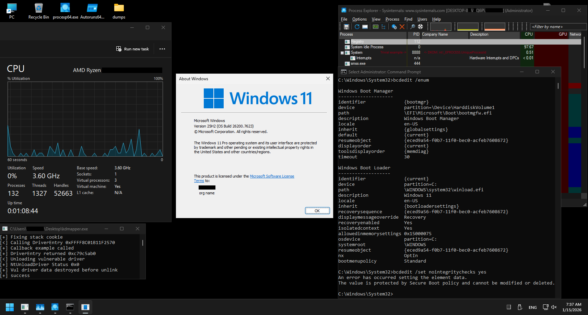

# TheiaPg: Defeating PatchGuard at Runtime - Windows 11 25H2

## Main description

`TheiaPg` is an PoC NT-Kernel module to prevent `PatchGuard` kernel integrity check routines from being performed before modification of critical kernel information (Critical-Kernel-Modules/Kernel-Objects/Other) is detected and the irretrievable PatchGuard `BugCheck-109h` (CRITICAL_STRUCTURE_CORRUPTION).

## Module compatibility
                                      
Loading methods: The module is fully compatible with loading img methods: Mapping-Img(no dependency on unwind-info)/WinAPI.

Hypervisor protect environment: The internal logic of the module is incompatible with hypervisor-based security (VBS/HVCI), since the module actively interacts with TablePages, and with EPT/NPT the hardware access attributes to the PhysFrame are controlled in the HPA-PTE.

Secure boot: The module is conditionally compatible with SecureBoot, if use Mapping-Img loading method.

## Additional description

Module image size with MSVC optimizations ~50kb.

# Result after the module testing session

